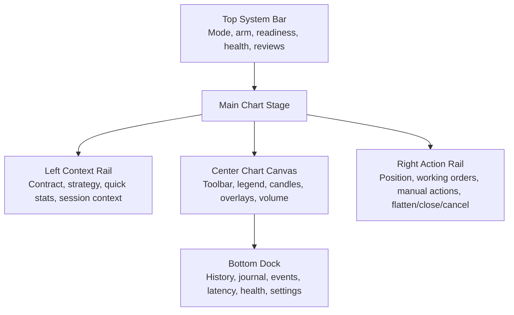

# Dashboard Chart-First Redesign Plan

## Purpose

The dashboard should now pivot from a broad operator console with a chart embedded inside it to a chart-first trading workspace where the live contract chart is the center of gravity and every other surface is arranged around it.

This document is now the source of truth for dashboard Phase 5 layout, visual, and workflow redesign work.
The separate functional chart-delivery plan still lives in [docs/architecture/dashboard_live_chart_plan.md](</C:/repos/TV_bot_core/docs/architecture/dashboard_live_chart_plan.md>) and remains the source of truth for chart data, overlays, and control-plane boundaries.

## Why Pivot Now

This pivot is the right next move because:

- the runtime-host chart control plane is already in place
- the live contract chart is already real, tested, and visually stable enough to become the main surface
- most remaining dashboard work is no longer missing raw capability, it is missing cohesive product shape
- the current layout still feels like several useful operator modules placed on one page rather than one polished, self-explanatory trading workspace

The product goal for this phase is clear:

- chart-first
- sleek and professional
- easy to scan
- self-explanatory without tutorial-level text
- polished enough to feel closer in spirit to Robinhood Legend than to an internal tool

This does **not** mean copying Robinhood branding or layout literally.
It means adopting the product principles that make modern chart-centric trading tools feel intuitive:

- the chart is the primary canvas
- related controls stay near the chart
- analysis, exposure, and action live in one place
- lower-priority audit and settings surfaces stay available but recede

## Research Snapshot

Research date: 2026-04-16

Official references reviewed:

- Robinhood Legend product page: [Robinhood Legend](https://robinhood.com/us/en/legend/)
- Robinhood Legend launch post: [The Legend Awakens](https://robinhood.com/us/en/newsroom/the-legend-awakens/)
- Robinhood Legend charts on mobile: [Introducing Robinhood Legend Charts on Mobile](https://robinhood.com/us/en/newsroom/introducing-robinhood-legend-charts-on-mobile/)
- TradingView Lightweight Charts official site: [Lightweight Charts](https://www.tradingview.com/lightweight-charts/)

### Research Takeaways

The Robinhood material repeatedly emphasizes:

- charts as the center of active-trader setups
- custom layouts and preset layouts
- linked widgets that keep context synchronized
- trade initiation close to the chart
- high-speed, real-time updates
- an interface that feels intuitive rather than legacy-terminal-heavy

The mobile chart announcement is especially important because Robinhood says about `90%` of Legend users center their setups around charts and frames charting around speed, precision, and seamless continuity between contexts.

The TradingView documentation reinforces that the chart layer we already chose is the right technical base for this product direction:

- interactive and responsive
- mobile-friendly
- real-time streaming updates
- finance-native legends, tooltips, price lines, markers, and range controls
- high performance with large series and frequent updates

### Product Principles Derived From Research

1. The chart must be the visual anchor, not a secondary widget.
2. High-frequency operator tasks should sit adjacent to the chart, not several scrolls away.
3. The interface should default to one strong layout before chasing limitless customization.
4. Context synchronization should feel obvious: the loaded strategy contract drives the chart, exposure, orders, and actions together.
5. The interface should explain itself through placement and labeling, not through paragraphs.
6. Sleek does not mean ornamental; it means calm hierarchy, fast scanning, and low-friction action.

## Architecture Guardrails

These rules remain fixed:

- The dashboard must consume only the local control plane.
- The chart must continue to show only the currently loaded strategy contract.
- The frontend must not become the source of truth for positions, orders, PnL, readiness, or safety state.
- Dangerous actions must still route through audited backend commands with confirmations.
- The execution core must remain strategy-agnostic.
- The redesign must preserve clear live, paper, and observation distinctions.

## Current Repo Reality

The current dashboard already has the pieces needed for this pivot:

- a working chart module in [apps/dashboard/src/components/dashboardLiveChart.tsx](</C:/repos/TV_bot_core/apps/dashboard/src/components/dashboardLiveChart.tsx>)
- extracted monitoring and operator modules in [apps/dashboard/src/components/dashboardMonitoring.tsx](</C:/repos/TV_bot_core/apps/dashboard/src/components/dashboardMonitoring.tsx>) and [apps/dashboard/src/components/dashboardControlPanels.tsx](</C:/repos/TV_bot_core/apps/dashboard/src/components/dashboardControlPanels.tsx>)
- dedicated orchestration hooks in [apps/dashboard/src/hooks](</C:/repos/TV_bot_core/apps/dashboard/src/hooks>)
- a dark-first visual system already in [apps/dashboard/src/styles.css](</C:/repos/TV_bot_core/apps/dashboard/src/styles.css>)
- host-backed status, readiness, chart, history, journal, settings, and command surfaces

What is missing is not the data path.
What is missing is a chart-first shell and information architecture that makes all of these surfaces feel like one product.

## North-Star Experience

The finished dashboard should answer these questions in the first few seconds without scrolling:

- What contract is loaded right now?
- What mode am I in?
- Am I armed, blocked, degraded, or review-required?
- Do I currently have exposure?
- What orders are working?
- What is the market doing right now?
- What is the next safe action I can take?

The chart should carry the visual weight of that experience.
Everything else should exist either to support reading the chart or to act on what the chart and runtime are telling the operator.

## Target Information Architecture

### Desktop

The chart should own the center of the page.

Recommended structure:

1. A slim top system bar
   Shows mode, arm state, readiness, warmup, dispatch posture, broker/data health, and any active review state.

2. A chart-stage row
   Three-part layout:
   - left context rail
   - center chart stage
   - right action and exposure rail

3. A lower dock
   Houses secondary information such as history, journal, events, latency, health details, and settings.

The chart stage should dominate the above-the-fold area.
On desktop, the center chart region should consume roughly `55-70%` of the visual weight.

### Tablet

- Keep the chart first
- collapse one side rail at a time into tabs or drawers
- keep the action rail easier to reach than the deep audit rail

### Mobile

- chart first, always
- top bar remains visible and compact
- context and action rails collapse into segmented drawers or bottom sheets
- lower dock becomes tabbed content below the chart

## Layout Blueprint

## Surface Responsibilities

### Top System Bar

This becomes the global posture strip, not a hero banner.

It should show only:

- mode
- arm state
- readiness or warmup
- dispatch availability
- feed health
- broker health
- active review state
- loaded strategy and contract identity

It should avoid long prose and should feel like an operator status strip, not a dashboard intro.

### Left Context Rail

This is the chart’s analysis context rail.
It should support reading, not action overload.

Recommended content:

- loaded strategy name and contract
- session state summary
- latest price and change
- timeframe summary
- key position stats when a position exists
- strategy metadata that helps interpret the chart
- replay or live state cues

This rail should not become a second audit feed.

### Center Chart Stage

This is the primary canvas.

It should include:

- timeframe switcher
- overlay toggles
- fit and live-follow controls
- compact OHLC and last-price readout
- active-position average line
- working-order overlays
- fill markers
- health and review banners inside the chart stage
- volume pane

The chart should feel calm and premium:

- generous space
- low chrome
- strong focus on price action
- toolbars that read more like instrument controls than like form inputs

### Right Action And Exposure Rail

This becomes the primary action surface.
It should hold the operator workflows currently spread across multiple broad cards.

Recommended content:

- active position summary
- working-order summary
- manual entry panel
- flatten current position
- close position
- cancel working orders
- no-new-entry gate
- warmup, arm, pause, resume, and disarm controls

Dangerous controls should remain visually isolated and confirmation-backed.

### Bottom Dock

This is where secondary information lives.
It should be tabbed or segmented so the operator can pull up detail without leaving the chart context.

Recommended dock tabs:

- Trades
- Journal
- Events
- Latency
- Health
- Settings

Settings should leave the primary right rail and move here.
They matter, but they should not compete with price, exposure, and action.

## Visual Direction

The design target should feel modern and premium without becoming decorative.

### Desired Tone

- dark, calm, and high-contrast
- confident rather than flashy
- finance-native rather than generic SaaS
- polished enough to feel consumer-friendly
- precise enough to feel operator-grade

### Visual Rules

- minimize heavy panel borders and box clutter
- use layered surfaces and spacing more than loud separators
- use typography and alignment to create hierarchy
- reserve strong accent color for mode, risk, and action
- keep the chart visually neutral enough that overlays remain legible

### Color Strategy

- keep the chart base mostly neutral
- use one unmistakable accent language for `live`
- one for `paper`
- one for `observation`
- one for warning and review-required
- one for destructive actions

These accents must stay readable without turning the page into a traffic-light collage.

### Copy Strategy

- remove development-flavored labels where possible
- replace long helper text with short direct labels
- prefer labels that answer operator questions
- use progressive disclosure for secondary explanations

Examples of the right tone:

- `Flatten current position`
- `No new entries`
- `Waiting for warmup`
- `Reconnect review required`
- `Broker connected`

Avoid copy that sounds like internal tooling or implementation detail unless it appears in the lower dock.

## Interaction Model

The interaction model should feel chart-led.

### Primary Interactions

- change timeframe
- toggle overlays
- fit chart
- follow live data
- inspect current position and working orders
- place manual entry from the adjacent action rail
- flatten or cancel without hunting through the page

### Secondary Interactions

- inspect journal and events
- review latency and health
- edit settings
- browse deeper history

### Progressive Disclosure

The rule should be:

- price, posture, exposure, and actions are always close
- detailed audit and configuration surfaces are one click away, not always expanded

## Scope Policy For Layout Customization

Robinhood-style customization is appealing, but we should not turn this redesign into a full layout-builder project immediately.

Recommended scope split:

### First Delivery

- one strong chart-first default layout
- collapsible or tabbed lower dock
- responsive rail collapse behavior
- no arbitrary drag-and-drop widget canvas yet

### Later Upgrade Path

- saved layout presets
- resizable rails
- chart-detached or multi-chart views
- custom workspace persistence

This keeps the redesign focused and achievable while still moving clearly toward a modern active-trader feel.

## Implementation Plan

### Phase 1: Chart-First Shell Reset

- Replace the current broad dashboard stack with a chart-stage shell
- Turn the existing top area into a slim system bar
- Move the chart directly into the center of the default view

Status:
- Landed on `main` as an initial shell reset
- Current implementation now has the top system bar, a chart-centered workspace stage, and a tabbed lower detail dock
- Remaining work in this phase is refinement, not first delivery

Likely file additions or refactors:

- `apps/dashboard/src/components/layout/*`
- `apps/dashboard/src/components/chartStage/*`
- `apps/dashboard/src/components/docks/*`

### Phase 2: Rail Recomposition

- Refactor current control-center surfaces into the right action rail
- Refactor key runtime and contract context into the left rail
- Reduce duplicated summary cards outside those rails

### Phase 3: Bottom Dock Migration

- Move history, journal, events, latency, health, and settings into a tabbed lower dock
- Make the dock denser and cleaner than the current long monitoring deck

### Phase 4: Visual Polish And Copy Sweep

- tighten spacing
- reduce verbose copy
- standardize iconography and badge density
- improve form clarity and control grouping
- make the whole interface feel more productized and less like a stitched control panel

### Phase 5: Responsive And Acceptance Pass

- verify the chart remains the primary surface at `390px`, `768px`, `1024px`, and `1440px`
- verify no page-level horizontal overflow
- verify the right action surface remains usable without chart obstruction
- verify the lower dock stays understandable on narrow widths

## Suggested Module Targets

The redesign should land on explicit modules instead of growing the current files again.

Suggested structure:

- `apps/dashboard/src/components/layout/dashboardShell.tsx`
- `apps/dashboard/src/components/layout/dashboardSystemBar.tsx`
- `apps/dashboard/src/components/chartStage/dashboardChartStage.tsx`
- `apps/dashboard/src/components/chartStage/dashboardContextRail.tsx`
- `apps/dashboard/src/components/chartStage/dashboardActionRail.tsx`
- `apps/dashboard/src/components/docks/dashboardBottomDock.tsx`
- `apps/dashboard/src/components/docks/*`

Suggested stylesheet split:

- `theme.css`
- `shell.css`
- `chart-stage.css`
- `rails.css`
- `dock.css`

The existing hooks and control-plane integration can mostly stay where they are.
This should be primarily an information-architecture and presentation refactor, not a data-contract rewrite.

## Test And QA Plan

The redesign is not done without explicit verification.

### Frontend Tests

- chart-first shell renders with loaded strategy and chart present
- right action rail renders key controls without clipping
- lower dock tabs switch correctly
- degraded, reconnect-review, and no-strategy states stay readable in the new shell

### Browser QA

- `390px`
- `768px`
- `1024px`
- `1440px`

Verify:

- no horizontal page overflow
- chart remains the visual anchor
- rails collapse intentionally
- no text spill in badges, rails, or dock tabs
- dangerous controls remain readable and confirmable

### Operator Review Checklist

- can an operator understand mode, readiness, and exposure in under five seconds?
- can an operator act on the current contract without scrolling through unrelated panels?
- does the chart feel like the product, not an add-on?
- does the interface feel self-explanatory enough to reduce operator anxiety?

## Acceptance Bar

The chart-first redesign is not complete unless all of the following are true:

- the chart is the clear primary surface above the fold on desktop and tablet
- the dashboard still remains understandable on mobile without hiding the chart behind forms
- the most common operator actions are adjacent to the chart
- audit and settings surfaces are available but no longer dominate the page
- live, paper, and observation states remain unmistakable
- the interface has no page-level horizontal overflow at supported widths
- the language feels production-ready and self-explanatory
- the layout feels like a polished trading workspace rather than a collection of cards

## Immediate Work Order

1. Treat this document as the new source of truth for dashboard Phase 5 redesign work.
2. Freeze a chart-first content inventory:
   decide exactly which current widgets move into the left rail, right rail, and bottom dock.
3. Refine the new shell and rail composition around the existing live chart.
4. Continue tightening the current control center inside the right action rail.
5. Continue tightening monitoring and audit depth inside the lower dock.
6. Run the copy and responsive QA pass.

## Documentation Follow-Up

Keep these docs aligned while the chart-first redesign lands:

- [README.md](</C:/repos/TV_bot_core/README.md>)
- [apps/dashboard/README.md](</C:/repos/TV_bot_core/apps/dashboard/README.md>)
- [docs/architecture/current_status.md](</C:/repos/TV_bot_core/docs/architecture/current_status.md>)
- [docs/architecture/dashboard_live_chart_plan.md](</C:/repos/TV_bot_core/docs/architecture/dashboard_live_chart_plan.md>)
